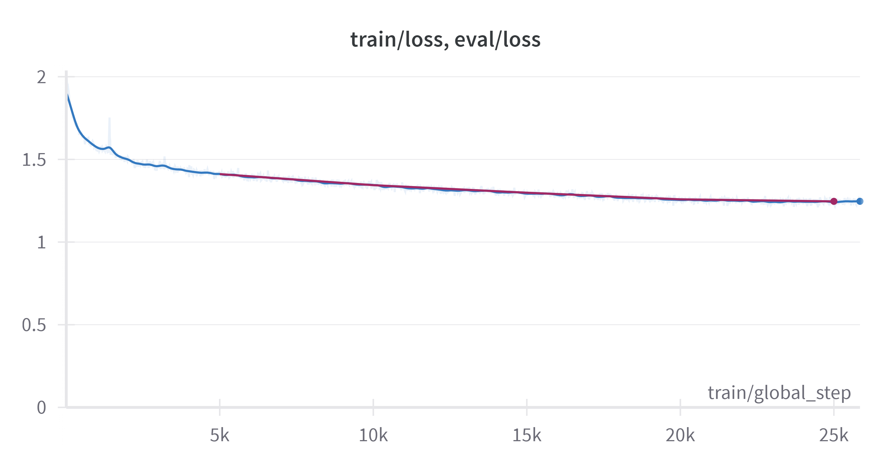

# Tinyllama-REFT
Our goal is to establish a lightweight language model which is capable of answering medical questions in Traditional Chinese. Considering privacy, we aim to develop a small language model that can be deployed locally. To explore other methods of finetuning LLM, we adopt the ReFT method to finetune our model.

Our model only needs less than 4G of GPU memory to run inference!!!

## continue pretraining (cPT)
To enhance model's ability to comprehend traditional Chinese, we continue pretrain the model on a high quality traditional Chinese dataset. This traditional Chinese dataset is composed of 2B tokens computed by tokenizer of LLaMA2. Moreover, to avoid catastrophic forgetting, we add 100K synthetic dataset in English to the training data. The distribution of different categories of the dataset is shown below:


The dataset has been pushed to [huggingface hub](https://huggingface.co/datasets/benchang1110/pretrainedtw).
Download the dataset using datasets library
```python
from datasets import load_dataset
dataset = load_dataset("benchang1110/pretrainedtw",split='train')
```
The sources of different categories are shown below:
* 新聞: 聯合報、TVBS、關鍵評論網、商業週刊、BBC、台灣好行

* 人文: 遠見雜誌、地球圖輯隊

* 科學: 科技大觀園、case報科學、科學月刊、泛科學

* 科技: inside、科技新報、科技島

* 維基百科: 繁體中文維基百科 (200K)

We continue pretrain the model for 1 epoch with a batch size of 32 and a learning rate of 1e-4. The model is trained on a single A100 GPU for 1 day.
loss curve: 


To continue pretrain the model, you may use the following command:
```bash
python cPT/train.py
```
remember to set the hyperparameters for your own needs~
To do inference, you may use the following command:
```bash
python cPT/inference.py
```
remember to set the path of the checkpoints~

## instruction finetuning
We use synthetic instruction finetuning [dataset](https://huggingface.co/datasets/benchang1110/ChatTaiwan) with 400K question-answer pairs to finetune our model.
Half of this dataset is generated by [taide/Llama3-TAIDE-LX-8B-Chat-Alpha1](https://huggingface.co/taide/Llama3-TAIDE-LX-8B-Chat-Alpha1), and the others are generated by GPT3.5 and GPT4.
We employ full-parameter finetuning (FP) with epoch=3, learning rate=5e-5 to finetune the model. The model is trained on a single A100 GPU for 1 day.


To finetune the model, you may use the following command:
```bash
python finetune/fullpar_finetune.py
```
To do inference, you may use the following command:
```bash
python finetune/inference.py
```
remember to set the path of the checkpoints~

## ReFT finetuning
For this project, we experiment with ReFT finetuning. We use the same synthetic instruction finetuning [dataset](https://huggingface.co/datasets/benchang1110/medicaltw) with 1.5K medical question-answer pairs generated by [MediaTek-Research/Breexe-8x7B-Instruct-v0_1](https://huggingface.co/MediaTek-Research/Breexe-8x7B-Instruct-v0_1).


To finetune the model, you may use the following command:
```bash
python finetune/reft_finetune.py
```
To do inference, you may use the following command:
```bash
python finetune/inference.py
```
remember to set the path of the checkpoints~

## Deployment
We use [chat-ui](https://github.com/huggingface/chat-ui) as frontend and [text-generation-inference](https://github.com/huggingface/text-generation-inference) as backend to deploy our model.

### Frontend
Clone chat-ui from huggingface
```bash
git clone https://github.com/huggingface/chat-ui.git
```
add .env.local in the folder, and set the following variables

```bash
MONGODB_URL=
HF_ACCESS_TOKEN=
SERPER_API_KEY=
```
you may change your port by modifying vite.config.ts
For more information, you may refer to the original [repository](https://github.com/huggingface/chat-ui)


### Backend
Clone text-generation-inference from huggingface
```bash
git clone https://github.com/huggingface/text-generation-inference.git
```
replace the Makefile, and type in terminal:
```bash
make run-tiny-llama
```

You may use docker instead, follow the guide on [text-generation-repo](https://github.com/huggingface/text-generation-inference)

## generation of synthetic dataset
We use [taide/Llama3-TAIDE-LX-8B-Chat-Alpha1](https://huggingface.co/taide/Llama3-TAIDE-LX-8B-Chat-Alpha1) to generate the synthetic dataset. Since Taide sometimes generate nonsense, we filter out the nonsense by using a simple rule-based method. We remove these nonsense by calculating the porprotion of unique tokens in the generated text. If the proportion is less than 0.2, we remove the text. The code is shown below:
```bash
python TaiwanChat_v2/process.py
```
The processed dataset is pushed to [huggingface hub](https://huggingface.co/datasets/benchang1110/ChatTaiwan)

To reproduce, run
```bash
python TaiwanChat_v2/main.py
```
